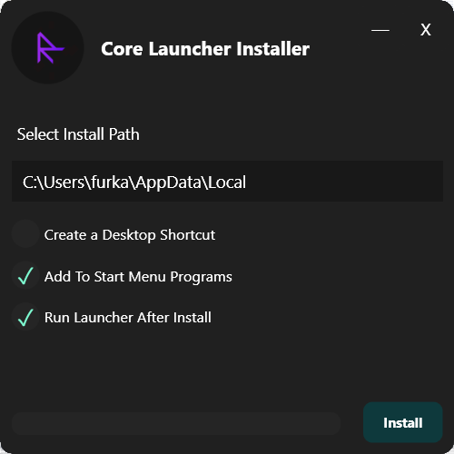

# Core Launcher Installer Project for Windows

This project gives you an easy installation and use process for Core Launcher. It has 2 parts: Installer and Wrapper.

## Important Notice

Due to embedded resources and libraries, your antivirus may warn you about the wrapper or the installer, but these are not viruses. 

You can compile from the source by downloading this repository.

## Installer

Installer is the first step. It was developed on .NET Framework 3.5, so every Windows OS can run without any dependencies.

1) Download from [here](https://github.com/etkmlm/CoreLauncherInstaller/releases/download/1.0/CoreLauncherInstaller.exe).
2) Customize the options according to your want.
3) Click on the install button.
4) Enjoy!

Installer will create a folder named "Core Launcher" in the selected path, and download the latest launcher and wrapper file from the network. Then it will run the wrapper.

You can delete the installer after the installation.

## Wrapper

Wrapper is an interface for the launcher. 

It checks if Java 17 is installed or not. If it is not installed, download and install it in the "Core Launcher" directory. Java which is installed by the wrapper is not listed in the programs menu, so if you wish to delete it, you can without any harm.

If Java 17 is installed before, it runs the launcher silently.
